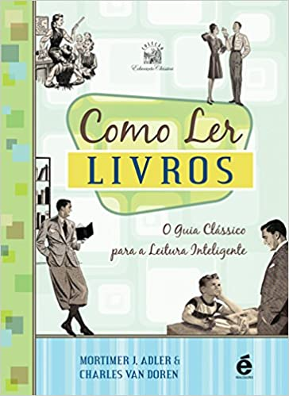

# Como ler livros

O livro fala sobre o quê

O que exatamente está sendo dito, e como?

O livro é verdadeiro,em todo ou em partes

E dai?

O livro é prático ou teórico?

## **Leitura Analítica**

* Regra 1 - Você tem que saber qual tipo de livro está lendo e deve saber o mais cedo possível, antes de começar a lê-lo, de preferência.

* Regra 2 - Expresse a unidade do livro em uma única frase, ou no máximo em algumas poucas frases.
* Regra 3 - Exponha as pates principais do livro e mostre como elas estão ordenadas em relação ao todo, ordenando-as umas as outras e à unidade do todo.
* Regra 4 - Descubra quais foram os problemas do autor.
* Regra 5 - Encontre as palavras importantes e, por meio delas, entre em acordo com o autor.
* Regra 6 - Marque as frases mais importantes do livro e descubra as proposições que elas contém.
* Regra 7 - Localize ou formule os argumentos básicos do livro com base nas conexões entre frases.
* Regra 8 - Descubra quais são as soluções do autor.
* Regra 9 - Você tem de dizer com razoável grau de certeza 'eu entendo' antes que possa dizer 'concordo' ou 'discordo' ou 'suspendo o julgamento'.
* Regra 10 - Quando discordar, faça-o de maneira sensata, sem gerar disputas ou discussões.
* Regra 11 - Respeite a diferença entre conhecimento e opinião fornecendo razões para quaisquer julgamentos críticos que fizer.

## Links úteis

https://en.wikipedia.org/wiki/How_to_Read_a_Book

https://www.erealizacoes.com.br/blog/como-ler-livros-o-guia-classico-para-a-leitura-inteligente/

https://www.artofmanliness.com/articles/how-to-read-a-book/

https://fs.blog/how-to-read-a-book/
