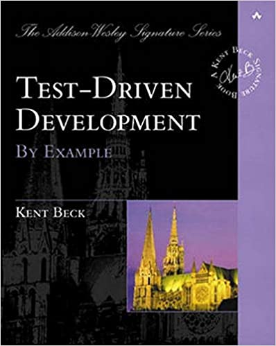

# Test-Driven Development: By Example

## Preface

Código limpo é importante, mas como alcança-lo? Drive development com testes automatizados "Test-Driven Development" (TDD). Nele voce:

* Escreve código novo só se primeiramente tiver um teste automatizado que falhou.
* Elimina duplicação.

As implicações técnicas dessas duas regras simples:

* Projetar organicamente
* Escrever seus próprios testes
* Fornecer resposta rápida a pequenas mudanças
* Projetar componentes altamente coesos e fracamente acoplados, apenas para facilitar o teste.

Essas duas regras implicam em uma ordem a tarefa de programar

* Vermelho - escrever um pequeno teste que não funciona e talvez nem compile
* Verde - fazer o teste funcionar rapidamente, cometendo todos os pecados no caminho
* Refatorar - eliminar toda a duplicação criada justamente pra fazer o teste funcionar

### Courage

TDD é uma forma de gerenciar o medo durante a programação

TDD é uma consciência da lacuna entre a decisão e o feedback durante a programação e as técnicas para controlar essa lacuna.

Certamente há tarefas de programação que não podem ser conduzidas apenas por testes, como software de segurança e concorrência.

## Cap 2: Section I: Money Example

Ritmo do TDD

1. Rapidamente adicione um teste
2. Rode todos os testes e veja o novo falhar
3. Faça uma pequena mudança
4. Rode todos os testes e veja todos passarem
5. Refatorar para remover duplicação

### Cap 3: Money Example

Não começamos com objetos, começamos com testes

Quando escrevemos um teste, imaginamos a interface perfeita para nossa operação. Estamos dizendo a nós mesmos como a operação será vista de fora. Nossa história nem sempre se tornará realidade, mas é melhor começar com a melhor API possível e trabalhar de tráz pra frente do que tornar as coisas complicadas, feias e "realistas" desde o início.

Pode-se acabar com vários erros de compilação em um único teste. Podemos precisar de um construtor, mas ele não precisa fazer nada. Podemos precisar de uma implementação vazia para métodos.

**Faremos o mínimo de trabalho possível apenas para que o teste seja compilado.**

Depois de solucionar os erros de compilação, executamos o teste e observamos sua falha. O fracasso é progresso. Transformamos um problema muito mais amplo para "fazer esse teste funcionar e fazer o resto dos testes funcionarem", que é, na verdade, um escopo muito mais simples e menor para o medo.

**Fazer passar**

O objetivo agora não é obter a resposta perfeita, o objetivo é passar no teste.

**Fazer certo**

Dependência é o problema chave no desenvolvimento de software em todas as escalas. Se a dependência é o problema, a duplicação é o sintoma.

Os objetos são excelentes para abstrair a duplicação da lógica. A eliminação da duplicação de programas elimina a dependência. Ao eliminar a duplicação antes de ir para o próximo teste, maximizamos nossa chance de conseguir executar o próximo teste com uma e apenas uma alteração.

TDD não é sobre darmos passos pequeninos; é sobre sermos capazes de dar passos pequeninos.

### Cap 4: Degenerate Objects

O ciclo geral de TDD

1. Escreva um teste. Você está escrevendo uma história. Invente a interface que você gostaria de ter. Inclua todos os elementos da história que você imagina serem necessários para calcular as respostas certas.
2. Faça funcionar. Obter rapidamente aquela barra verde domina todo o resto.
3. Faça isso direito. Remova a duplicação que você introduziu para obter o verde rápido. O objetivo é um código limpo que funcione.

Dividir e conquistar, resolvendo a parte "que funciona", e depois resolver o "código limpo".

Estratégias para se chegar ao verde rapidamente:

* Engane-o - retorne uma constante e gradualmente substitua contantes por variáveis até ter o código real.
* Use a implementação óbvia - codifique a implementação real.

### Cap 5: Equality for All

Existe uma terceira estratégia, a triangulação. Ignoramos brevemente a duplicação entre o código de teste e o código do modelo. Quando o segundo exemplo exige uma solução mais geral, então, e somente então, generalizamos.

Usar a triangulação quando não tiver certeza de como refatorar.

>Por que eu precisaria escrever outro teste para me dar permissão para escrever o que provavelmente poderia ter escrito da primeira vez?

Quando ideias sobre o design não estiverem vindo, triangulação dá a chance de pensar sobre o problema de uma direção ligeiramente diferente.

### Cap 7: Franc-ly Speaking

As diferentes fases têm propósitos diferentes. Diferentes estilos de solução e diferentes pontos de vista são necessários. As três primeiras fases precisam ser feitas rapidamente, para que cheguemos em um estado conhecido com novas funcionalidades. Pode-se cometer qualquer número de pecados para se chegar lá, mas só momentaneamente.

### Cap 8: Equality for All, Redux

Quando você não tem testes suficientes, provavelmente encontrará refatorações que não são suportadas por testes. Pode-se fazer algo errado na refatoração e mesmo assim os teste passarem.

Escreva os testes que desejaria que tivesse. Caso contrário, você acabará quebrando algo durante a refatoração.

### Cap 10: Makin' Objects

Quando se tem duas subclasses que não estão fazendo trabalho o suficiente para justificar sua existência talvez seja melhor eliminá-las.

Um passo mais perto de eliminar as subclasses é ter menos referências às subclasses diretamente. Como usar Factory Method na classe pai para remover referências às subclasses.

Ao desacoplar os testes da existência das subclasses, demos a nós mesmos liberdade para alterar a herança sem afetar nenhum código do modelo.

### Cap 11: Time We're Livin' in

Trabalhar em pequenos passos é uma recomendação, se parecer restritivo, dê passos maiores. Se você não tiver certeza, dê passos menores. TDD é um processo de direção.

### Cap 12: Interesting Times

Em vez de aplicar minutos de raciocínio suspeito, podemos simplesmente perguntar ao computador, fazendo a alteração e executando os testes.

Sem os testes você não tem escolha, você tem que raciocinar. Com os testes, você pode decidir se um experimento responderia à pergunta mais rapidamente.

Preferível não escrever um teste quando se tem uma barra vermelha. Não podemos alterar o código do modelo sem um teste. O caminho conservador é voltar com as mudanças que causaram a barra vermelha, e voltar a verde. Em seguida, alteramos o teste, corrigimos a implementação e tentamos novamente a mudança original.

### Cap 18: Abstraction Finally

Possivelmente irá se ter quase o mesmo número de linhas de código de teste e de implementação ao fazer TDD. Para que o TDD faça sentido do ponto de vista económico, você deverá ser capaz de escrever duas vezes mais linhas por dia do que antes ou escrever a metade das linhas para a mesma funcionalidade. Você terá que medir e ver o efeito que o TDD tem em sua própria prática. No entanto, certifique-se de considerar o tempo de depuração, integração e explicação de suas métricas.

O TDD pode ser usado como uma forma de buscar a perfeição, mas esse não é o uso mais eficaz. Se você tem um sistema grande, as peças que você toca o tempo todo devem ser absolutamente sólidas, para que você possa fazer alterações diárias com segurança.

### Cap 19: Money Retrospective

O TDD pode ser usado como uma forma de buscar a perfeição, mas esse não é o uso mais eficaz. Se você tem um sistema grande, as peças que você toca o tempo todo devem ser absolutamente sólidas, para que você possa fazer alterações diárias com segurança.

A cobertura certamente não é uma medida suficiente da qualidade do teste, mas é um ponto de partida. Outra forma de avaliar a qualidade do teste é a inserção do defeito. A ideia é simples, mude o significado de uma linha de código e um teste deve ser interrompido.

**Uma última revisão**

Os três itens que aparecem repetidamente como surpresas ao ensinar TDD são:

* As três abordagens para fazer um teste funcionar de forma limpa: fingir, triangular e apenas digitar a solução certa para começar.
* Remover a duplicação entre teste e código como forma de direcionar o design.
* A capacidade de controlar a lacuna entre os testes para aumentar a tração quando a estrada fica escorregadia e cruzeiro mais rápido quando as condições são mais claras.
